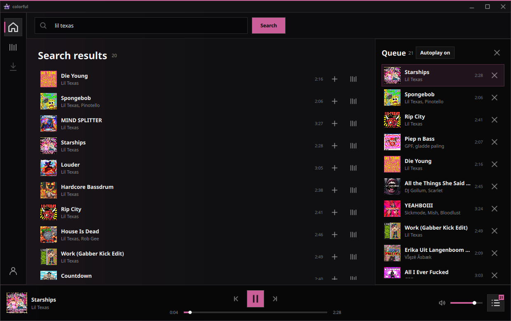

<p align="center">
  
</p>

<h1 align="center">colorful</h1>

<p align="center">
  A colorful, local-first personal music player built natively for each platform.
</p>

<p align="center">
  <strong>Linux · Android · Windows · iOS (planned)</strong>
</p>

> [!IMPORTANT]
> **This project is entirely AI-made.** It is a personal project built to meet
> my own music playback needs, and an exception to my usual stance on
> AI-generated code.

> [!CAUTION]
> **colorful is not a piracy project.** It does not provide accounts, shared
> credentials, subscription bypasses, provider tokens, or account sources. You
> must use your own legitimate provider account and configuration.

<p align="center">
  
</p>

<p align="center"><sub>Early Linux build. The interface is actively changing.</sub></p>

## About

colorful is a local-first personal streaming and music-library client. TIDAL is
the primary provider; public SoundCloud and public/optionally authenticated
YouTube Music desktop paths are also working.

- Platform-native playback, media sessions, credentials, and interfaces
- A shared Rust core for queues, storage, offline-job state, and listening history
- Device-local data with no required colorful account or central library server

Future parties and device sync may use encrypted relays, but provider
credentials remain device-local.

## Current status

colorful is an early personal alpha, not a packaged consumer release.

| Target | Status | Current implementation |
| --- | --- | --- |
| Linux | Usable alpha | Qt 6/QML, embedded libmpv, MPRIS, Discord Rich Presence and statistics widget, Secret Service, TIDAL, YouTube Music, and SoundCloud, persistent queue/library |
| Android | Working vertical slice | Kotlin/Compose, Media3 `MediaSessionService`, Android Keystore, TIDAL device linking/search/playback, and Rust/SQLite queue persistence |
| Windows | Qt alpha build | The same Qt/QML desktop shell as Linux, embedded libmpv over WASAPI, Windows media controls, DPAPI credentials, and the Rust/SQLite engine |
| iOS | Planned | SwiftUI, AVFoundation/AVAudioEngine, Keychain, system Now Playing integration |
| macOS | Not targeted | No first-party target is planned |

### Working today

- TIDAL device linking and subscription-aware full-track playback
- account-country discovery with a cached fallback
- TIDAL collection, playlists, personalized daily/discovery/new-release shelves,
  catalog pages, and account/subscription details
- public YouTube Music song, video, release, artist, and uploader-channel search; paginated channel uploads, catalog pages, playback, downloads, and genuine radio/automix on Linux
- optional locally stored YouTube Music browser session for private library content, playlists, and personalized mixes
- public SoundCloud mixed search, tracks, profiles, sets, related radio, catalog pagination, playback, quality-aware downloads, and optional uploader originals on Linux
- optional locally stored SoundCloud OAuth session for personalized home shelves, liked tracks, sets, owned playlists, followed profiles, and account recommendations
- independent TIDAL, YouTube, and SoundCloud search continuation without resetting the visible result list
- lossless/adaptive playback with accurate duration and seeking
- persisted perceptual desktop volume, real mute, and selectable Linux output
- prepared-next, gapless Linux playback with prefetched autoplay
- persistent reorderable queue, play-next insertion, repeat/shuffle, playback
  position, autoplay, and related tracks
- provider-neutral local playlists with ordered duplicates, create/rename/delete,
  collection-wide adds, and editing from every desktop track surface
- provider-first desktop lyrics with TIDAL synchronization, YouTube Music
  lyrics, LRCLIB fallback, offline caching, and adjustable timing
- Linux MPRIS and Discord Rich Presence
- Android system media session and background playback ownership
- album-art-derived, contrast-safe accent colors
- selectable TIDAL stream quality and album-derived or fixed accent modes
- persistent 10-band Linux equalizer with presets, clipping protection, and ReplayGain normalization
- resumable desktop TIDAL, YouTube, and SoundCloud downloads with durable checkpoints,
  artwork, local-file playback, storage summaries, configurable quotas, and
  confirmed bulk cleanup
- a persistent low-data mode that avoids loading remote artwork and profile images
- qualified local listening history and top-track/top-artist/top-album statistics
- opt-in Discord profile statistics publishing with Secret Service token storage
- desktop settings for accounts, stream quality, autoplay, EQ/normalization, Discord integrations, appearance, low-data behavior, storage, and build information
- sync-ready, idempotent history event identities

### On the roadmap

- Android EQ and normalization using the shared audio-processing contract
- Android offline downloads and YouTube Music support
- encrypted multi-device library sync and playback handoff
- parties over LAN, ICE/STUN, and an encrypted relay fallback
- Windows packaging and interactive-runtime polish; iOS native shell

## Architecture

```text
Native UI
  │
  ├── native playback + media session + credential store
  ├── platform/provider source resolution
  └── versioned C/JSON commands and events
                    │
             colorful-core (Rust)
                    │
       SQLite · queue · library · history
       settings · offline-job records

Desktop provider host (transitional TypeScript process; bundled on Windows)
  └── TIDAL + public SoundCloud + public/authenticated YouTube Music adapters
```

Playback is intentionally platform-owned. The portable engine does not decode
audio or attempt to replace Media3, libmpv, AVFoundation, or Windows media APIs.

## Repository layout

| Path | Purpose |
| --- | --- |
| `crates/colorful-core` | Portable Rust domain engine, SQLite repositories, migrations, and stable native ABI |
| `packages/provider-kit` | Typed provider contracts and shared migration fixtures |
| `packages/provider-host` | Transitional Bun-based desktop provider adapter; compiled to a standalone executable on Windows |
| `apps/linux` | Shared Qt Quick/QML desktop client (historical path), with libmpv, MPRIS on Linux, and SMTC/WASAPI on Windows |
| `apps/android` | Native Kotlin/Compose client with Media3 and JNI bindings |
| `apps/design-lab` | Disposable React UI prototype; not a production client |
| `apps/windows` | Archived WinUI prototype; the active Windows target uses the shared Qt desktop shell |
| `apps/ios` | iOS target plan |
| `docs` | Architecture, storage, connectivity, sync, provider, CI, and integration notes |
| `scripts` | Reproducible build, run, and test entry points |

## Provider and account requirements

colorful does not bundle provider accounts or private provider configuration.
Supply your own TIDAL account and permitted client configuration in a local
environment file:

```bash
cp .env.example .env
set -a
source .env
set +a
```

Never commit `.env` or post credentials. Linux stores provider secrets through
Secret Service, Windows encrypts them per user with DPAPI, and Android uses
Android Keystore.

Authenticated YouTube Music uses a browser session captured from your own
account. See the [YouTube Music account setup guide](docs/youtube-music-login.md).
SoundCloud can likewise import only the OAuth header from one of your own
logged-in API requests; see the [SoundCloud account setup guide](docs/soundcloud-login.md).

colorful is not affiliated with, endorsed by, or sponsored by TIDAL, Discord,
SoundCloud, YouTube, or their respective owners. Product names belong to their
owners.

## Running the Linux client

Required development tools currently include Rust, Bun, CMake 3.25+, Ninja,
Qt 6.8+ (`Core`, `Gui`, `Quick`, `QuickControls2`, `Network`, and `DBus`),
`pkg-config`, libmpv development files, SQLite's CLI for schema tests,
`secret-tool` for secure login persistence, `yt-dlp` for YouTube playback,
radio, and downloads, and `ffmpeg` for offline download assembly. Public
YouTube Music browsing/search itself does not require `yt-dlp`.

With the provider environment exported:

```bash
./scripts/run-linux.sh
```

For an instant relaunch of the existing binary without checking for source
changes, use `./scripts/run-linux.sh --no-build`.

See [the Linux client guide](apps/linux/README.md) for the manual test flow,
MPRIS checks, and troubleshooting.

## Building Windows

The active Windows client is the same Qt/QML desktop shell. Install Visual
Studio 2022 with MSVC x64, Rust, Bun, CMake, Ninja, and Git, then provision Qt
and libmpv and launch from PowerShell:

```powershell
powershell -ExecutionPolicy Bypass -File .\scripts\provision-windows-qt.ps1
powershell -ExecutionPolicy Bypass -File .\scripts\run-windows-qt.ps1
```

The build uses libmpv's WASAPI output, supports shared and exclusive modes,
publishes Windows system media controls, protects provider credentials with
DPAPI, and bundles the provider host so Bun is not required at runtime. See
[the Windows guide](apps/windows/README.md).

## Building Android

Install Android Studio with SDK 36, NDK `30.0.15729638`, CMake 4.1.2, an
arm64/x86_64 Rust Android toolchain, and the provider environment described
above. Then run:

```bash
./scripts/build-android.sh
```

If needed, install the Rust targets first:

```bash
rustup target add aarch64-linux-android x86_64-linux-android
```

The Android application ID is `sh.valerie.colorful`. See
[the Android client guide](apps/android/README.md) for its current scope.

## Checks

On a fresh checkout, install the provider-kit TypeScript development
dependencies once:

```bash
(cd packages/provider-kit && bun install)
```

Run the complete Linux-oriented suite:

```bash
./scripts/test-linux.sh
```

Run only the raw SQLite migration/constraint checks:

```bash
./scripts/test-storage-schema.sh
```

## Privacy and security model

- Provider and Discord credentials stay in the operating system credential
  store and are excluded from portable sync.
- Playback manifests and signed media URLs are never persisted as durable
  credentials.
- Listening history and library data remain local unless encrypted sync is
  explicitly enabled in a future build.
- Planned party peers exchange provider references and commands, not account
  tokens.
- Relays must not receive plaintext libraries, queues, credentials, or audio.

Read [the sync design](docs/sync.md), [party connectivity model](docs/connectivity.md),
and [local storage contract](docs/storage.md) for the longer version.

## Discord integrations

Desktop Rich Presence publishes the active local track through Discord's local
IPC connection. The separate owner-only profile widget publishes aggregate
all-time listening statistics and can eventually include mobile listens
received through encrypted sync. Its Application ID is editable so each user
can connect an application and widget configuration they own. Bot tokens stay
in the platform credential store and are kept separate per application.

Setup and the published field contract are documented in the
[Discord statistics widget guide](docs/discord-widget.md).

## Contributing and AI-generated code

Bug reports should include the platform, reproduction steps, and non-secret
logs. Never post tokens, credentials, signed media URLs, or downloaded media.

## Licensing

colorful is free software licensed under the GNU General Public License,
version 3 or (at your option) any later version (`GPL-3.0-or-later`). See
the [LICENSE](LICENSE) file.

Dependencies and bundled assets retain their own licenses. Binary distributors
must also comply with the licenses of the exact Qt, libmpv, and other dependency
builds they ship.
