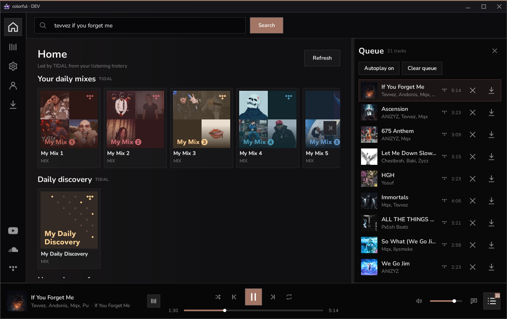

<p align="center">
  
</p>

<h1 align="center">colorful</h1>

<p align="center">
  A local-first music player with native playback and a library that stays on your devices.
</p>

<p align="center">
  <a href="https://github.com/atvalerie/colorful/releases/latest"></a>
  <a href="https://github.com/atvalerie/colorful/actions/workflows/release.yml"></a>
  <a href="LICENSE"></a>
</p>

<p align="center">
  <a href="https://github.com/atvalerie/colorful/releases/latest"><strong>Download</strong></a>
  · <a href="docs/README.md">Documentation</a>
  · <a href="docs/todo.md">Roadmap</a>
  · <a href="CONTRIBUTING.md">Contributing</a>
</p>

<p align="center"><strong>Linux · Windows · Android · iOS</strong></p>

> [!IMPORTANT]
> **This project is entirely AI-made.** It is a personal project built to meet
> my own music playback needs, and an exception to my usual stance on
> AI-generated code.

<p align="center">
  
</p>

<p align="center"><sub>This is an early desktop build.</sub></p>

## About

colorful is a personal music player built around device-local storage and
native platform integration. Your queue, library, playlists, history, settings,
and offline jobs stay on your device. colorful has no account system or central
library server.

The desktop client connects to TIDAL, YouTube Music, and SoundCloud for catalog
and playback features. Spotify can optionally provide catalog, playlist, and
recommendation metadata; Colorful matches Spotify tracks back to TIDAL, which
remains the playback source. System media controls and credential storage live
in each client. The clients share a Rust library and queue engine.

> [!NOTE]
> colorful is still in alpha. The desktop app is furthest along. Android and
> iOS are under active development. Provider changes may occasionally break
> playback or account sessions.

## Highlights

- Unified Home and Search for TIDAL, YouTube Music, SoundCloud, and optional
  Spotify catalog metadata.
- A persistent queue with reordering, play next, repeat, shuffle, autoplay,
  prepared-next playback, and restoration.
- Resumable downloads with artwork, storage quotas, cleanup, and local playback.
- Synchronized lyrics, cached fallbacks, radio, recommendations, related tracks,
  and listening history.
- Optional Spotify search, albums, artists, playlists, library, and
  personalization, with ISRC-verified TIDAL matches for playback.
- libmpv audio with gapless transitions, selectable output, ReplayGain, and a
  10-band equalizer.
- Linux MPRIS, Windows media controls, and Discord Rich Presence.
- Provider credentials stored through the operating system's credential store.
- Experimental encrypted listening parties using an opaque relay.

## Availability

| Platform | Stage | Distribution |
| --- | --- | --- |
| Linux | Active desktop alpha | AppImage and portable archive |
| Windows | Active desktop alpha | Per-user setup and portable ZIP |
| Android | TIDAL engineering slice | Build from source |
| iOS | Active development shell | Unsigned nightly IPA or build from source |

Download the current Linux and Windows packages from the
[latest release](https://github.com/atvalerie/colorful/releases/latest).
Windows packages are currently unsigned, so SmartScreen may display a warning.
The desktop updater verifies the published SHA-256 digest before offering an
update.

Mobile development and installation details live in the
[Android guide](apps/android/README.md) and [iOS build guide](docs/ios-builds.md).

## Provider accounts

TIDAL uses device authorization. YouTube Music and SoundCloud work anonymously
for public catalog features and can optionally connect to your account. Spotify
is an optional desktop catalog and recommendation source; a free Spotify
account is enough for metadata and personalization, while playback remains on
TIDAL. Spotify playlist editing and Spotify audio playback are not provided.

On desktop, YouTube Music and Spotify use persistent, isolated Chromium
profiles. Only initial sign-in or re-authentication is visible; later
cookie-backed restore and refresh run in a hidden browser session while music
requests remain native. SoundCloud still captures its token from a temporary
profile. The browser handles passwords and forms, and colorful saves only the
minimum provider state in the operating system credential store. During
YouTube Music or Spotify restore, the isolated Chromium process may briefly
appear as a browser process or taskbar icon. It does not open an interactive
login page and should not repeatedly steal focus. Manually pasted YouTube
headers remain a static fallback and cannot refresh through the hidden profile.

- [Connect YouTube Music](docs/youtube-music-login.md)
- [Connect SoundCloud](docs/soundcloud-login.md)
- [Connect Spotify catalog and recommendations](docs/spotify-login.md)

## Architecture

```text
Qt / Compose / SwiftUI
├── native playback, media controls, and secure credentials
├── provider adapters
│   ├── compiled desktop provider host
│   └── native mobile implementations
└── colorful-core (Rust)
    └── SQLite · queue · library · playlists · history · offline jobs
```

Each client handles playback through libmpv, Media3, or AVFoundation. The Rust
core handles shared state such as the queue, library, history, and offline jobs.

Read the [architecture overview](docs/architecture.md), [core ABI](docs/core-abi.md),
and [storage contract](docs/storage.md) for the implementation details.

## Documentation

Start with the [documentation hub](docs/README.md).

| Area | Guides |
| --- | --- |
| Desktop | [Linux](apps/linux/README.md) · [Windows](apps/windows/README.md) |
| Mobile | [Android](apps/android/README.md) · [iOS](apps/ios/README.md) · [iOS builds](docs/ios-builds.md) |
| Providers | [YouTube Music](docs/youtube-music-login.md) · [SoundCloud](docs/soundcloud-login.md) · [Spotify recommendations](docs/spotify-login.md) · [migration map](docs/provider-migration.md) |
| Internals | [Architecture](docs/architecture.md) · [storage](docs/storage.md) · [native ABI](docs/core-abi.md) |
| Social | [Parties](docs/parties.md) · [sync](docs/sync.md) · [connectivity](docs/connectivity.md) |
| Project | [Roadmap](docs/todo.md) · [contributing](CONTRIBUTING.md) · [third-party notices](THIRD_PARTY_NOTICES.md) |

Each platform guide contains its build requirements and commands.

## Project notes

> [!CAUTION]
> **colorful is not a piracy project.** It does not provide accounts, shared
> credentials, subscription bypasses, provider tokens, or account sources. Use
> your own legitimate provider accounts and follow each provider's terms.

Bug reports should include the platform, reproduction steps, and non-secret
logs. Never post tokens, credentials, signed media URLs, or downloaded media.

## License

colorful is free software licensed under
[GPL-3.0-or-later](LICENSE). Dependencies and bundled assets retain their own
licenses; see the [third-party notices](THIRD_PARTY_NOTICES.md).
