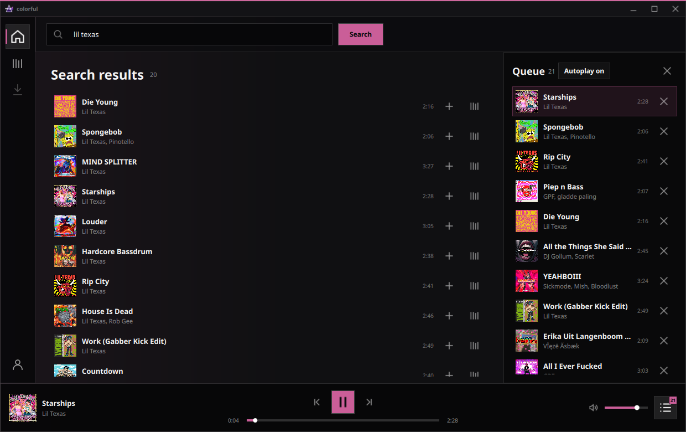

<p align="center">
  
</p>

<h1 align="center">colorful</h1>

<p align="center">
  A local-first music player with native playback and a library that stays on your devices.
</p>

<p align="center">
  <a href="https://github.com/atvalerie/colorful/releases/latest"></a>
  <a href="https://github.com/atvalerie/colorful/actions/workflows/release.yml"></a>
  <a href="LICENSE"></a>
</p>

<p align="center">
  <a href="https://github.com/atvalerie/colorful/releases/latest"><strong>Download</strong></a>
  · <a href="docs/README.md">Documentation</a>
  · <a href="docs/todo.md">Roadmap</a>
  · <a href="CONTRIBUTING.md">Contributing</a>
</p>

<p align="center"><strong>Linux · Windows · Android · iOS</strong></p>

<p align="center">
  
</p>

<p align="center"><sub>Early desktop build shown; the interface continues to evolve.</sub></p>

## At a glance

colorful is a personal music player built around device-local state and native
platform integration. Your queue, library, playlists, history, settings, and
offline jobs live on your device—there is no required colorful account or
central library server.

The desktop client connects to TIDAL, YouTube Music, and SoundCloud. Each native
client owns playback, system media controls, and secure credential storage while
sharing the same Rust library and queue engine.

> [!NOTE]
> colorful is active alpha software. Provider web APIs can change, sessions can
> expire, and the mobile clients intentionally trail the desktop feature set.

## Highlights

- **One desktop library across providers** — unified Home and Search without
  flattening each service's own relevance.
- **A real music-player queue** — persistence, reordering, play next,
  repeat/shuffle, autoplay, prepared-next playback, and restoration.
- **Offline listening** — resumable provider downloads, artwork, quotas,
  cleanup, and local-file playback.
- **Lyrics and discovery** — synchronized lyrics, cached fallbacks, related
  tracks, radio, recommendations, and listening history.
- **Native desktop audio** — libmpv, gapless transitions, selectable output,
  ReplayGain, a 10-band equalizer, MPRIS, Windows media controls, and Discord
  Rich Presence.
- **Local-first by design** — provider credentials stay in the operating
  system credential store; signed media URLs are not treated as durable secrets.
- **Experimental listening parties** — encrypted party state over an opaque
  relay, without sending provider credentials or audio through colorful.

## Availability

| Platform | Stage | Distribution |
| --- | --- | --- |
| Linux | Active desktop alpha | AppImage and portable archive |
| Windows | Active desktop alpha | Per-user setup and portable ZIP |
| Android | TIDAL engineering slice | Build from source |
| iOS | Active development shell | Unsigned nightly IPA or build from source |

Download the current Linux and Windows packages from the
[latest release](https://github.com/atvalerie/colorful/releases/latest).
Windows packages are currently unsigned, so SmartScreen may display a warning.
The desktop updater verifies the published SHA-256 digest before offering an
update.

Mobile development and installation details live in the
[Android guide](apps/android/README.md) and [iOS build guide](docs/ios-builds.md).

## Provider accounts

TIDAL uses device authorization. YouTube Music and SoundCloud work anonymously
for public catalog features and can optionally connect to your account.

On desktop, colorful opens an installed Chromium-family browser with an isolated
temporary profile, observes the authenticated provider request over loopback,
and retains only the minimum session data in the operating system credential
store. It does not embed a web view or receive your password.

- [Connect YouTube Music](docs/youtube-music-login.md)
- [Connect SoundCloud](docs/soundcloud-login.md)

## How it fits together

```text
Qt / Compose / SwiftUI
├── native playback, media controls, and secure credentials
├── provider adapters
│   ├── compiled desktop provider host
│   └── native mobile implementations
└── colorful-core (Rust)
    └── SQLite · queue · library · playlists · history · offline jobs
```

Playback remains platform-owned: the shared engine coordinates state but does
not replace libmpv, Media3, AVFoundation, or platform media-session APIs.

Read the [architecture overview](docs/architecture.md), [core ABI](docs/core-abi.md),
and [storage contract](docs/storage.md) for the implementation details.

## Documentation

Start with the [documentation hub](docs/README.md).

| Area | Guides |
| --- | --- |
| Desktop | [Linux](apps/linux/README.md) · [Windows](apps/windows/README.md) |
| Mobile | [Android](apps/android/README.md) · [iOS](apps/ios/README.md) · [iOS builds](docs/ios-builds.md) |
| Providers | [YouTube Music](docs/youtube-music-login.md) · [SoundCloud](docs/soundcloud-login.md) · [migration map](docs/provider-migration.md) |
| Internals | [Architecture](docs/architecture.md) · [storage](docs/storage.md) · [native ABI](docs/core-abi.md) |
| Social | [Parties](docs/parties.md) · [sync](docs/sync.md) · [connectivity](docs/connectivity.md) |
| Project | [Roadmap](docs/todo.md) · [contributing](CONTRIBUTING.md) · [third-party notices](THIRD_PARTY_NOTICES.md) |

Build requirements and commands are kept with each platform guide rather than
duplicated here.

## Project notes

> [!IMPORTANT]
> **This project is entirely AI-made.** It is a personal project built to meet
> my own music playback needs, and an exception to my usual stance on
> AI-generated code.

> [!CAUTION]
> **colorful is not a piracy project.** It does not provide accounts, shared
> credentials, subscription bypasses, provider tokens, or account sources. Use
> your own legitimate provider accounts and follow each provider's terms.

Bug reports should include the platform, reproduction steps, and non-secret
logs. Never post tokens, credentials, signed media URLs, or downloaded media.

## License

colorful is free software licensed under
[GPL-3.0-or-later](LICENSE). Dependencies and bundled assets retain their own
licenses; see the [third-party notices](THIRD_PARTY_NOTICES.md).
